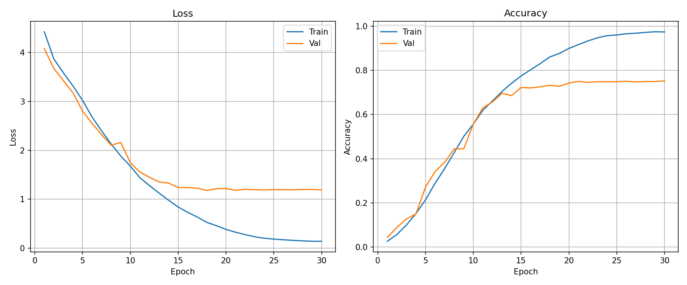
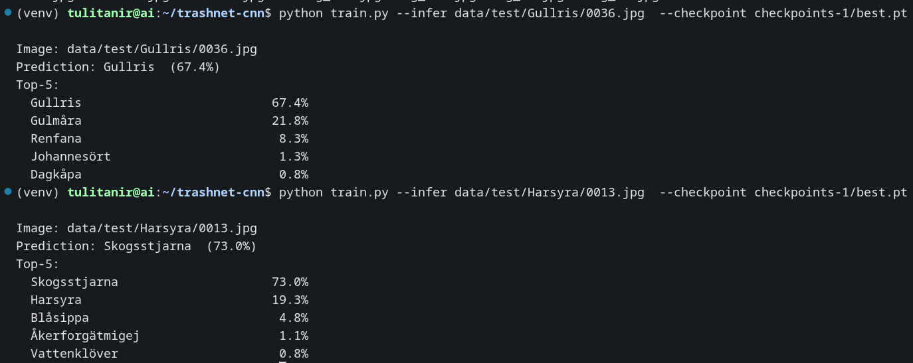

## Цель работы

Цель данной практической работы — реализация свёрточной нейронной сети для классификации изображений набора данных Swedish Flowers с применением современных фреймворков глубокого обучения.

---

## 1. Подготовка данных

В качестве датасета используется [Swedish Flowers](https://huggingface.co/datasets/renukadevichappidi/swedish-flowers-dataset) — набор фотографий дикорастущих цветов Швеции с изображениями размером **224×224 пикселей** в формате RGB. Датасет уже распределён по разбиениям в формате `ImageFolder` и размещён в директории `data/`.

| Разбиение | Образцов | Классов |
|---|---|---|
| train      | 10 796 | 90 |
| validation |  1 349 | 90 |
| test       |  1 351 | 90 |

Каждая папка с классом названа по шведскому названию вида растения (например, `Blåklint`, `Gullviva`, `Humlelusern`).

```
data/
├── train/
│   ├── Backtimjan/
│   ├── Blodrot/
│   └── ...  (90 папок)
├── validation/
│   └── ...
└── test/
    └── ...
```


---

## 2. Реализация

Проект состоит из четырёх модулей:

| Файл | Назначение |
|---|---|
| `config.py` | Гиперпараметры и пути |
| `model.py`  | Архитектура EfficientNet (b0/b1) |
| `train.py`  | Цикл обучения и инференс |

### 2.1 Конфигурация

Ключевые параметры задаются в `config.py`:

```python
DATASET_DIR = Path("data")
CKPT_DIR    = Path("checkpoints")
VERSION     = "b0"   # вариант EfficientNet: b0 или b1
NUM_CLASSES = 90
IMG_SIZE    = 224
BATCH_SIZE  = 128
EPOCHS      = 20
LR          = 1e-3
```

### 2.2 Архитектура модели
(Почти такая же реализация EfficientNet использовалась в моей [курсовой работе](https://github.com/Tulitanir/efficientnet_test) на 3 курсе)

В основе EfficientNet лежит метод комплексного масштабирования (compound scaling). До его появления для улучшения точности модели использовали один из трёх независимых способов: увеличение разрешения входного изображения, увеличение числа каналов (ширина) или увеличение числа слоёв (глубина). Авторы EfficientNet показали, что между этими тремя параметрами существует взаимосвязь, и предложили масштабировать их совместно с помощью коэффициентов α (глубина), β (ширина) и γ (разрешение). Базовой является архитектура EfficientNet-B0; все остальные варианты семейства получаются из неё применением данного метода.

Сеть состоит из входного свёрточного блока, семи стадий блоков MBConvN и финального свёрточного блока 320→1280, за которым следует глобальный пулинг и классификатор. Ниже описаны ключевые строительные блоки.

**CNNBlock** — базовый свёрточный блок: свёртка → BatchNorm2d → SiLU. Функция активации SiLU определяется как `silu(x) = x · σ(x)`, где σ — сигмоида.

**MBConvN** — основной строительный блок, вдохновлённый модулем *inverted residual with linear bottleneck* из MobileNetV2. Входной тензор с ограниченным числом каналов сначала расширяется (если `expansion_factor > 1`), затем проходит через depthwise и pointwise свёртки, и число каналов вновь сокращается. Depthwise свёртка применяет отдельный фильтр к каждому каналу (`groups = in_channels`), pointwise — свёртка 1×1 по всем каналам. Такое разбиение тяжёлой свёртки на две последовательные, предложенное в MobileNet, позволяет значительно снизить вычислительную сложность без существенной потери точности. При совпадении размерностей входа и выхода используется *skip connection* (остаточное соединение), впервые применённое в ResNet и позволяющее бороться с проблемой затухающего градиента.

**SqueezeExcitation** — модуль канального внимания, зарекомендовавший себя в MobileNetV3. Глобальный пулинг «сжимает» пространственную информацию до одного значения на канал, затем два слоя FC со сжатием (SiLU) и восстановлением (Sigmoid) формируют веса каналов, на которые поэлементно умножается входной тензор. Это позволяет сети акцентировать важные каналы при минимальных дополнительных вычислениях.

**StochasticDepth** — регуляризатор, который в режиме обучения случайно «пропускает» весь блок с вероятностью `1 − survival_prob`. Ускоряет обучение и снижает переобучение, не влияя на инференс.

### 2.3 Загрузка и аугментация данных

Данные загружаются через `torchvision.datasets.ImageFolder`. Для тренировочной выборки применяется аугментация:

```python
transforms.Compose([
    transforms.Resize((224, 224)),
    transforms.RandomHorizontalFlip(),
    transforms.RandomCrop(224, padding=4),
    transforms.ColorJitter(brightness=0.2, contrast=0.2, saturation=0.2),
    transforms.ToTensor(),
    transforms.Normalize([0.485, 0.456, 0.406], [0.229, 0.224, 0.225]),
])
```

### 2.4 Цикл обучения

В качестве функции потерь используется кросс-энтропия, оптимизатор — Adam, планировщик — косинусное затухание. На GPU задействовано смешанное обучение (bfloat16) через `torch.autocast`.

```python
criterion = nn.CrossEntropyLoss()
optimizer = torch.optim.Adam(model.parameters(), lr=LR)
scheduler = torch.optim.lr_scheduler.CosineAnnealingLR(optimizer, T_max=EPOCHS)
```

На каждой эпохе модель обучается на тренировочной выборке и оценивается на val. Лучший чекпоинт по точности на val сохраняется в `checkpoints_efficientnet/best.pt`, финальный — в `checkpoints_efficientnet/last.pt`.

```
Epoch   1/20 | train loss 3.8421 acc 0.1023 | val loss 3.4812 acc 0.1562
Epoch   2/20 | train loss 2.9104 acc 0.2341 | val loss 2.8821 acc 0.2893  ← best
...
```

Запуск обучения:

```bash
python train_efficientnet.py
```

---

## 3. Результаты обучения

Модель обучалась 30 эпох. Графики потерь и точности представлены ниже.



| Метрика | Значение |
|---|---|
| Лучшая точность на val | **75.24%** (эпоха 30) |
| Точность на test | **77.35%** |
| Train loss (эпоха 30) | 0.1377 |
| Val loss (эпоха 30) | 1.1902 |

Несколько последних эпох из лога:

```
Epoch  20/30 | train loss 0.3820 acc 0.8993 | val loss 1.2183 acc 0.7428
Epoch  21/30 | train loss 0.3234 acc 0.9165 | val loss 1.1817 acc 0.7502  ← best
...
Epoch  26/30 | train loss 0.1696 acc 0.9655 | val loss 1.1947 acc 0.7509  ← best
Epoch  30/30 | train loss 0.1377 acc 0.9738 | val loss 1.1902 acc 0.7524  ← best

Test loss 1.1278 acc 0.7735
```

### Анализ стагнации

На графиках хорошо видна классическая картина переобучения: начиная примерно с эпохи 20 train accuracy продолжает расти (89% → 97%), тогда как val accuracy стабилизируется в диапазоне 74–75%. Val loss при этом практически не снижается (~1.19–1.22), тогда как train loss падает до 0.14. Разрыв между тренировочной и валидационной точностью в ~22 процентных пункта указывает на то, что модель начинает запоминать обучающую выборку, а не обобщать.

---

## 4. Тестирование модели

```bash
python train.py --infer path/to/image.jpg --checkpoint checkpoints/best.pt
```

Вывод содержит предсказанный класс и топ-5 вероятностей:

```
Image: path/to/image.jpg
Prediction: Smörblomma  (87.3%)
Top-5:
  Smörblomma                      87.3%
  Gullviva                         6.1%
  Blåklint                         3.4%
  Vallmo                           2.0%
  Ängsklocka                       1.2%
```



---

## 5. Почему свёрточные сети лучше MLP для классификации изображений

### 5.1 Ограничения MLP

Многослойный персептрон обрабатывает изображение как плоский вектор пикселей, теряя пространственную структуру. Для входа 224×224×3 это **150 528 признаков** — при первом полносвязном слое на 512 нейронов получается уже ~77 млн параметров только в первом слое. Помимо этого:

| Проблема | Пояснение |
|---|---|
| **Нет инвариантности к сдвигу** | Объект, смещённый на несколько пикселей, воспринимается как другой входной вектор |
| **Взрывной рост числа параметров** | Число параметров пропорционально `H × W × C × hidden_size` |
| **Нет локальной связности** | Смысловые признаки (края, текстуры) имеют локальную природу, MLP её игнорирует |
| **Потеря структуры при flatten** | Теряется информация о 2D-расположении пикселей |

### 5.2 Преимущества CNN

**Разделение весов.** Один фильтр 3×3×3 (27 параметров) применяется ко всем позициям изображения — инвариантность к сдвигу при минимальном числе параметров.

**Иерархическое извлечение признаков.** Ранние слои детектируют края и текстуры, глубокие — части объектов и целые объекты. MLP лишён такой иерархии.

**Масштабируемость.** EfficientNet-b0 содержит ~5 млн параметров и эффективно работает на 224×224 изображениях, тогда как эквивалентный MLP потребовал бы на порядки больше параметров при существенно худшем качестве.

### 5.3 Численное сравнение

| Характеристика | MLP (вход 224×224×3) | EfficientNet-b0 |
|---|---|---|
| Параметров первого слоя (→512) | ~77 млн | — |
| Всего параметров | >77 млн | ~5 млн |
| Инвариантность к сдвигу | Нет | Да |
| Учёт пространственной структуры | Нет | Да |
| Иерархические признаки | Нет | Да (7 стадий MBConv) |

---

## Вывод

В ходе выполнения практической работы реализован конвейер классификации изображений Mini ImageNet на базе EfficientNet-b0: конвертация Parquet-данных в формат `ImageFolder`, обучение свёрточной сети, сохранение чекпоинтов и визуализация кривых обучения.

Показано, что CNN принципиально превосходят MLP на задачах классификации изображений за счёт разделения весов и иерархического извлечения признаков — при числе параметров в десятки раз меньшем.
